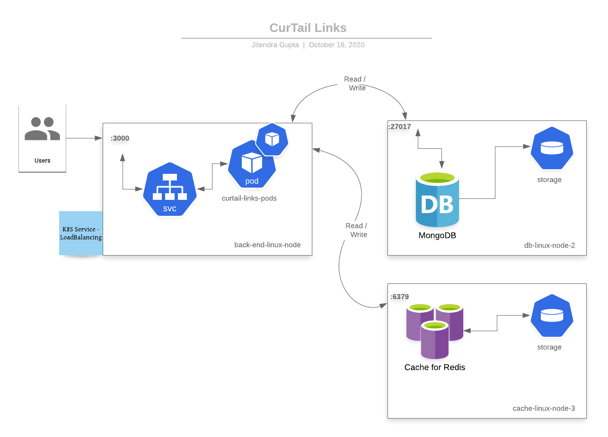
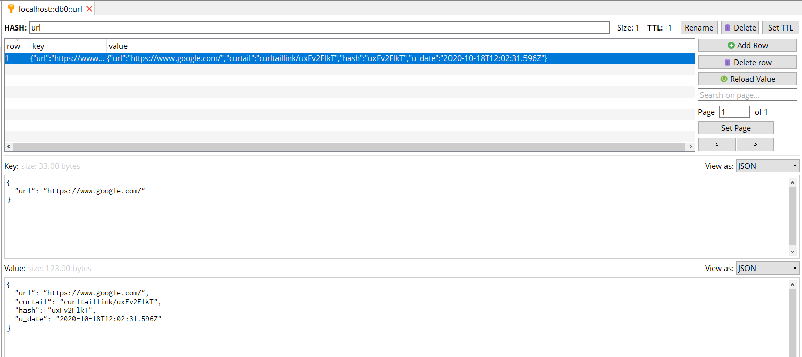

<h1 align="center">
  curtail-links
</h1>
<h4 align="center">NodeJs CurTail Link Server</h4>

</br>
Using Express, Mongo (Database), Redis (Caching)

## Snapshots



## Getting Started

#### Clone GitHub Project
```sh
git clone https://github.com/jlohiya/curtail-links.git curtail-links
cd curtail-links
```

#### Run Server

```
# Move to project
cd curtail-links/
# Install dependencies
npm install

# Start  server
npm start
```

## Use Cases / Script to test the service
```
# Set a CurTail Link
curl --location --request POST 'http://127.0.0.1:3000/curltaillink' \
--header 'Content-Type: application/json' \
--data-raw '{
    "method": "POST",
    "url": "https://www.youtube.com/"
}'

# Get a CurTail Link
curl --location --request GET 'http://127.0.0.1:3000/curltaillink/Ix69PNeJg'

```

## ☑ TODO

- [ ] Use same redis for caching while GET
- [ ] Helm Charts - HeathMonitoring (/Ping), Autoscaling, expose Prometheus Metrics and add Grafana dashboard
- [ ] apply ttl
- [ ] apply rate limits on create and get (may be based on userid)
- [ ] should we make create-short-url service as different microservice?


## Limitations
1. Encoding: base64 (A-Z, a-z, 0-9, _-) - 9 char hash - 64^9 possible urls stored
2. Packaging: Use webpack to package the server, currently bundle exposes all JS code
3. Performance: Will need to generate load test to see latencies
4. Vulneribility: Server can be made busy with false gets/posts as there is no rate limit
5. Monitoring: Currently the server start relies on console logs and needs monitoring with metrics and also by exposing health ports

